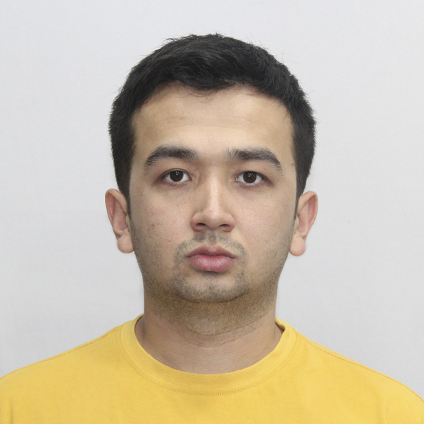

## Photo



# Mavlon Turgunov

## About Me

I am a frontend developer in training with strong knowledge of JavaScript, HTML, and CSS.  
Currently, I am improving my skills in React and TypeScript while preparing for a career in tech.  
My long-term goal is to work at a leading company like Google and contribute to building innovative products.

## Contacts

- **Email:** mavlondev2023@gmail.com
- **GitHub:** [MavlonTurgunof](https://github.com/MavlonTurgunof)
- **LinkedIn:** https://www.linkedin.com/in/mavlon-turgunov-62602b2b9/
- **Telegram:** @MavlonTurgunof
- **Phone:** +998950420319

## Skills

- HTML5, CSS3, Responsive Web Design
- JavaScript (ES6+), TypeScript
- React
- Git, GitHub, Git branching
- Basic knowledge of Python & Django (learning)
- Problem solving (LeetCode, algorithms)

## Code Example

Example task: _Count the number of duplicates_

```javascript
function duplicateCount(text) {
  const lower = text.toLowerCase();
  const counts = {};
  for (let i of lower) {
    counts[i] = (counts[i] || 0) + 1;
  }

  let result = 0;
  for (let key in counts) {
    if (counts[key] > 1) {
      result++;
    }
  }

  return result;
}
```

## Work Experience

-Saidoff Group — Internship (June 2024 – September 2024)

-Saidoff Group — Front-end Developer (September 2024 – October 2024)

-Repid Group — Front-end Developer (October 2024 – May 2025)

-Startup Garage — Front-end Developer (July 2025 – September 2025)

## Education

Westminster International University in Tashkent (2020–2025)

## Language

English — B2 (currently improving, preparing for IELTS certification)
